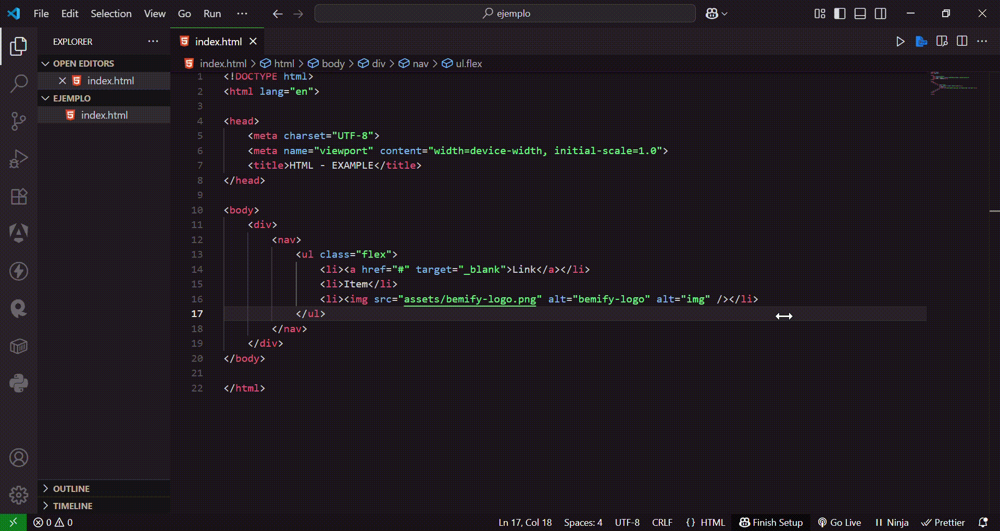
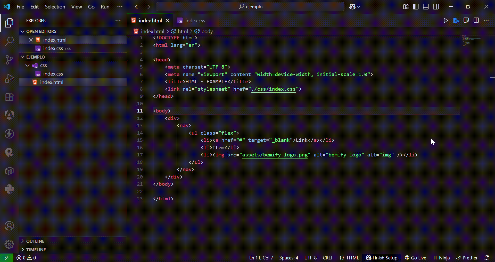
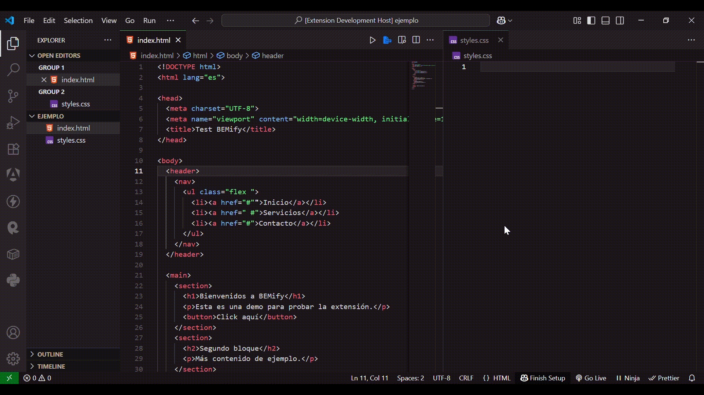
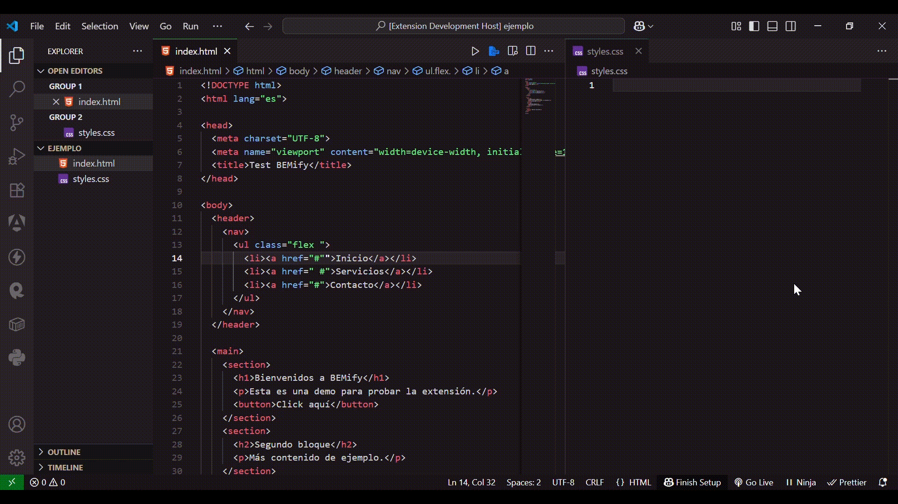

[🇪🇸 Español](README.es.md)

# BEMify - VSCode Extension

BEMify is a Visual Studio Code extension that automatically applies CSS classes using the **BEM (Block Element Modifier)** methodology to selected HTML fragments, and generates the corresponding CSS rules in your project.

## 📦 Features

- Prompts the user for a base class name.
- Parses the selected HTML and adds BEM classes following the hierarchical structure.
- Generates CSS rules for each created class.
- Automatically searches for a common CSS file (`styles.css`, `main.css`, `app.css`, `index.css`, `style.css`, `estilos.css`, `estilo.css`) in your project:
  - If it exists, appends the new classes to the end.
  - If it doesn’t exist, creates a `styles.css` file with the generated classes.
- Preserves original attributes of HTML elements.
- Compatible with projects that already have existing classes.
- 🔄 **Switchable modes**:  
  - **Modern mode** (default): generates nested class naming (e.g., `header__nav, header__nav__ul, header__nav__ul__li`).  
  - **Classic mode**: generates flatter class naming (e.g., `header_nav, header_ul, header_li`).  
  - Use the command **`bemify-mode`** to switch modes — it opens a select where you can choose **modern** or **classic**.

## 🚀 Usage

1. Select an HTML fragment in your editor.
2. Run the command:
   - **From the Command Palette**: `Ctrl+Shift+P` (Windows/Linux) or `Cmd+Shift+P` (macOS), then type **"bemify"**.
   - Or use the registered command: `extension.applyBEM`.
3. Enter the base class name (e.g., `header`).
4. The extension will:
   - Modify the selected HTML by adding BEM classes.
   - Create or update the corresponding CSS file.
5. Switch the naming mode at any time with the command:
   - **`bemify-mode`** → choose **modern** or **classic** from the select.

## 📂 Example

Original HTML:

```html
<div>
  <nav>
    <ul class="flex">
      <li><a href="#" target="_blank">Link</a></li>
      <li>Item</li>
      <li></li>
    </ul>
  </nav>
</div>
```

### Modern mode (default)

Modified HTML:

```html
<div class="header">
  <nav class="header__nav">
    <ul class="flex header__nav__ul">
      <li class="header__nav__ul__li">
        <a href="#" target="_blank" class="header__nav__ul__li__a"
          >Link</a
        >
      </li>
      <li class="header__nav__ul__li">Item</li>
      <li class="header__nav__ul__li">
        
      </li>
    </ul>
  </nav>
</div>
```

Generated CSS:

```css
.header { /* styles */ }
.header__nav { /* styles */ }
.header__nav__ul { /* styles */ }
.header__nav__ul__li { /* styles */ }
.header__nav__ul__li__a { /* styles */ }
.header__nav__ul__li__img { /* styles */ }
```

### Classic mode

Modified HTML:

```html
<div class="header">
  <nav class="header_nav">
    <ul class="flex header_ul">
      <li class="header_li">
        <a href="#" target="_blank" class="header_a">Link</a>
      </li>
      <li class="header_li">Item</li>
      <li class="header_li">
        
      </li>
    </ul>
  </nav>
</div>
```

Generated CSS:

```css
.header { /* styles */ }
.header_nav { /* styles */ }
.header_ul { /* styles */ }
.header_li { /* styles */ }
.header_a { /* styles */ }
.header_img { /* styles */ }
```

## Video tutorial 

### Modern mode without CSS
In this example, a `styles.css` file is automatically created since it does not exist yet.  


### Modern mode with existing CSS
Here, an existing stylesheet is detected and the new classes are appended at the end.  


### Switching to Modern mode with existing CSS
The user selects **Modern mode** from the `bemify-mode` command.  


### Switching to Classic mode with existing CSS
The user selects **Classic mode** from the `bemify-mode` command.  



## 🛠 Dependencies

node-html-parser - MIT License.
